# 毕业设计怎么写-以基于springboot的旅游管理系统为例轻松解决毕业设计

<h4 style='color:red'>联系不到我，就看我的主页 </h4> 
 
#### 系统概要

介绍一款基于Spring Boot的旅游管理系统的毕业设计，其是一款专为旅游行业设计的综合性平台，旨在提供方便快捷的景点浏览、酒店预定和游记分享服务。系统拥有管理员和用户两种角色，管理员负责系统的管理和运营，用户则可以通过系统获取旅游信息并进行相关操作。

#### 研究背景

当前社会各行业领域竞争压力非常大，随着当前时代的信息化，科学化发展，让社会各行业领域都争相使用新的信息技术，对行业内的各种相关数据进行科学化，规范化管理。这样的大环境让那些止步不前，不接受信息改革带来的信息技术的企业随时面临被淘汰，被取代的风险。所以当今，各个行业领域，不管是传统的教育行业，餐饮行业，还是旅游行业，医疗行业等领域都将使用新的信息技术进行信息革命，改变传统的纸质化，需要人手工处理工作事务的办公环境。软件信息技术能够覆盖社会各行业领域是时代的发展要求，各种数据以及文件真正实现电子化是信息社会发展的不可逆转的必然趋势。本旅游管理系统也是紧跟科学技术的发展，运用当今一流的软件技术实现软件系统的开发，让家具销售库存管理信息完全通过管理系统实现科学化，规范化，程序化管理。从而帮助信息使用者节省事务处理的时间，降低数据处理的错误率，对于基础数据的管理水平可以起到促进作用，也从一定程度上对随意的业务管理工作进行了避免，同时，旅游管理系统的数据库里面存储的各种动态信息，也为上层管理人员作出重大决策提供了大量的事实依据。总之，旅游管理系统是一款可以真正提升使用者的使用效率的软件系统。

#### 技术栈

后端技术栈：Springboot+Mysql+Maven

前端技术栈：Vue+Html+Css+Javascript+ElementUI

开发工具：Idea+Vscode+Navicate

#### 系统功能介绍

管理员角色功能模块  
个人中心：管理员可以查看和管理个人信息，进行密码修改等操作，确保账户的安全性。  
用户管理：管理员可以管理系统内所有用户的信息，包括注册用户和操作权限管理。  
景点分类管理：管理员可以管理景点信息的分类，如城市分类、景点类型等。  
景点信息管理：管理员可以管理和更新系统中的景点信息，确保信息的准确性和完整性。  
景点购票管理：管理员可以管理景点的票务信息，包括票价、购票流程等。  
酒店信息管理：管理员可以管理系统中的酒店信息，包括酒店的位置、设施、价格等。  
酒店预定管理：管理员可以管理酒店的预定信息，包括客房类型、价格、预定流程等。  
游记分享管理：管理员可以管理用户发布的游记信息，确保内容的合法性和真实性。  
系统管理：管理员可以管理系统的基础数据、公告资讯等，确保系统的正常运行和信息更新。  

用户角色功能模块  
景点信息：用户可以浏览和查询系统中的景点信息，包括景点的介绍、图片、交通等。  
酒店信息：用户可以查看系统中的酒店信息，包括酒店的位置、价格、评价等。  
游记分享：用户可以阅读和发布游记，分享旅行经验和感受。  
公告资讯：用户可以获取系统发布的最新公告和旅游资讯。  
个人中心：用户可以查看和管理个人信息，修改密码等操作，确保账户安全。  
后台管理：  
景点购票管理：用户可以在后台管理中进行景点票务的预订和购买。  
酒店预定管理：用户可以在后台管理中进行酒店房间的预定和管理。  
游记分享管理：用户可以在后台管理中发布和管理自己的游记内容。  

#### 系统功能结构设计

在分析并得出使用者对程序的功能要求时，就可以进行程序设计了。如下展示的就是管理员功能结构图。

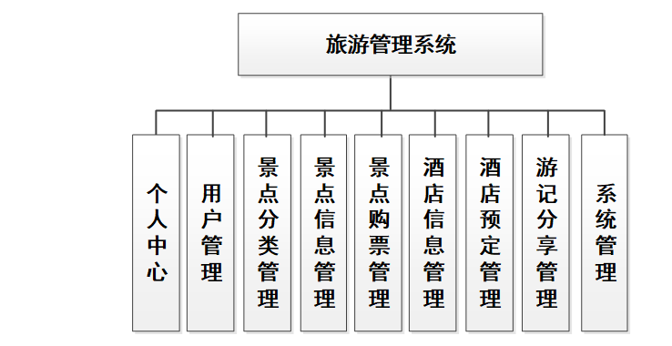

#### 系统流程分析

操作流程分析

程序上交给用户进行使用时，需要提供程序的操作流程图，这样便于用户容易理解程序的具体工作步骤，现如今程序的操作流程都有一个大致的标准，即先通过登录页面提交登录数据，通过程序验证正确之后，用户才能在程序功能操作区页面操作对应的功能。

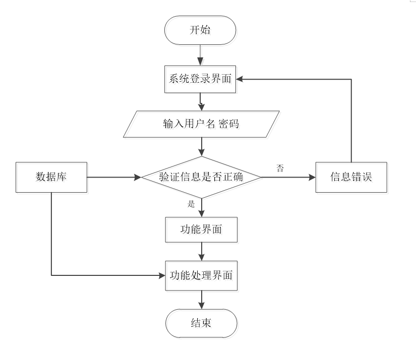

登录流程分析

在这个部分，需要对程序的登录功能模块的运行流程，进行单独说明。程序设置登录模块也是为了安全起见，让用户使用放心，登录模块主要就是让用户提交登录信息，程序进行数据验证，验证通过的用户才能够成功登录程序。

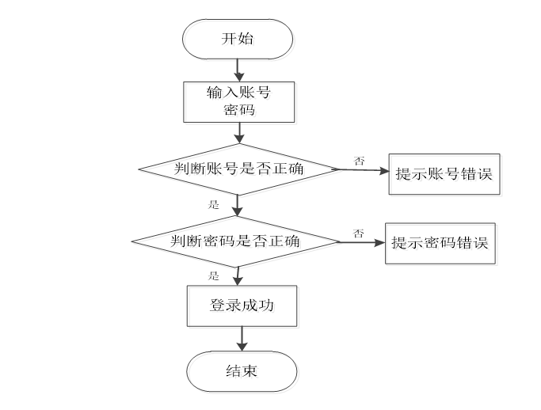

信息添加流程分析

程序的添加功能就是提供给操作者录入信息的功能，不管是涉及到用户信息添加，还是其它功能模块涉及到的信息添加，程序的信息添加流程都是一致的。程序都是先对操作者录入的数据进行判定，这个判定规则是一段提前编写完成的程序代码，当程序判定数据符合要求时，才会把操作者录入的数据登记在数据表里面，比如添加的用户信息，就会把新添加的用户信息写入用户信息的数据表文件里面。

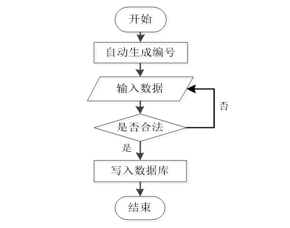

信息删除流程分析

当从程序里面删除某种无效数据时，遵循程序的信息删除流程，先要选中操作者需要删除的数据，程序为了预防操作者误删信息，也会进行提示，当操作者真正确定要删选中的信息时，该信息就会从数据库中被永久删除。

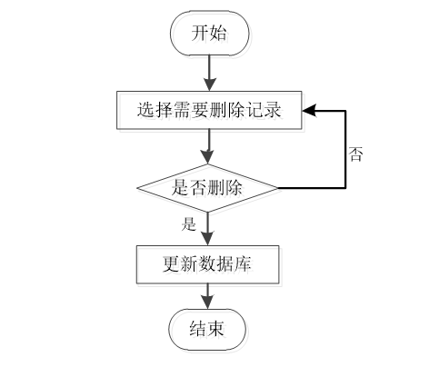

#### 系统作用

基于Spring Boot的旅游管理系统在现代旅游业中具有重要作用：

提升管理效率：系统通过信息化管理和智能化服务，提高了景点、酒店和游记等信息的管理效率，实现了信息的及时更新和准确发布。  
优化用户体验：系统为用户提供了方便快捷的查询和预订服务，提升了用户的体验和满意度。  
促进旅游信息共享：系统通过游记分享功能，鼓励用户分享旅游经验和感受，促进旅游信息的广泛共享和传播。  
支持智能决策：系统通过数据分析和反馈机制，为管理员提供决策支持，优化运营管理策略，提升服务质量和市场竞争力。  

#### 系统功能截图

登录

景点信息

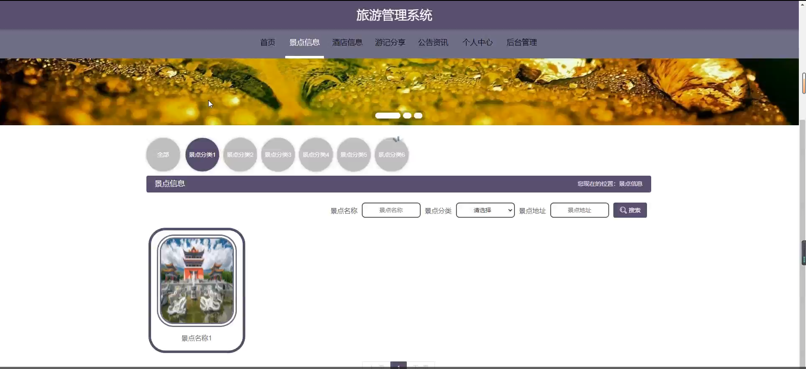

酒店信息

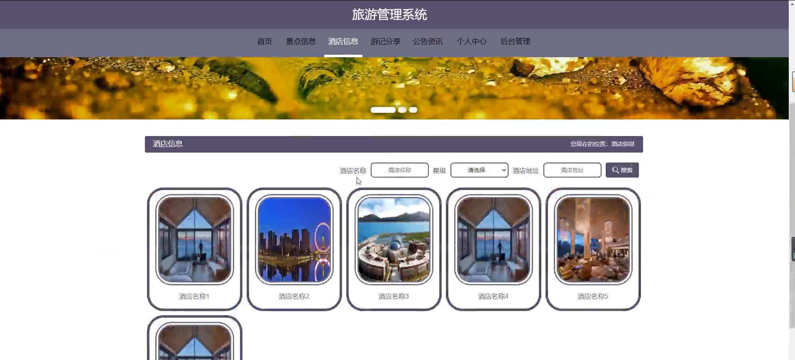

个人中心

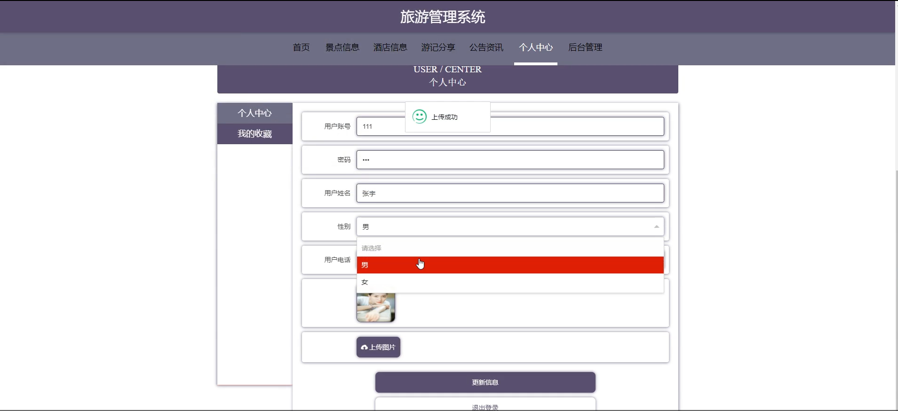

用户端后台管理

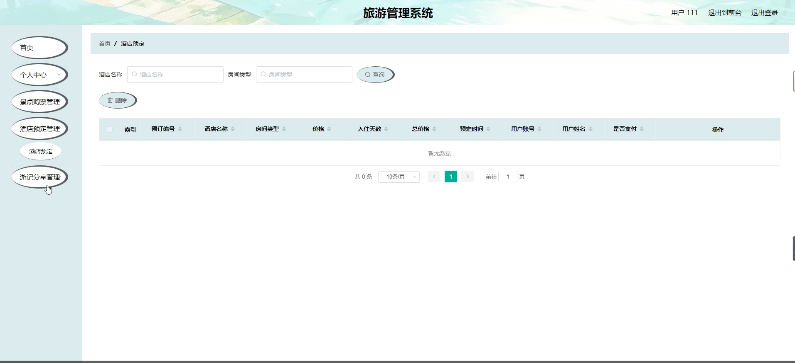

用户管理

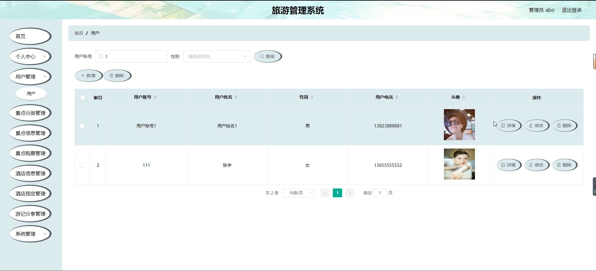

景点购票管理

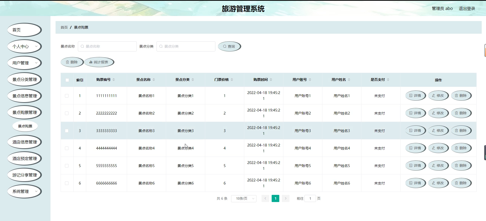

游记分享管理

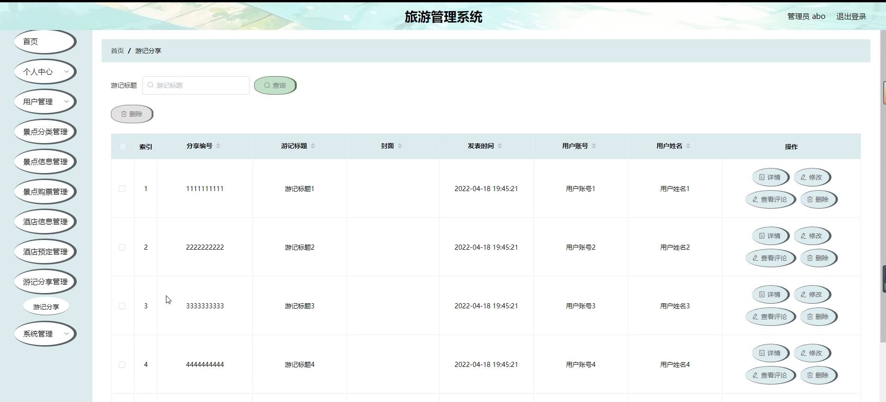

系统管理

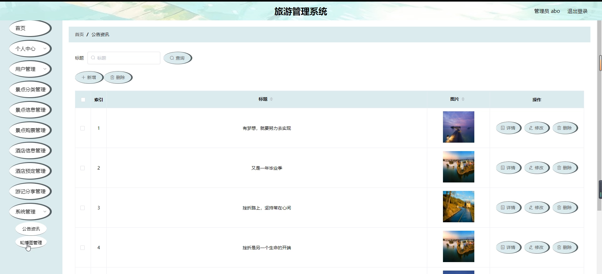

酒店预订管理

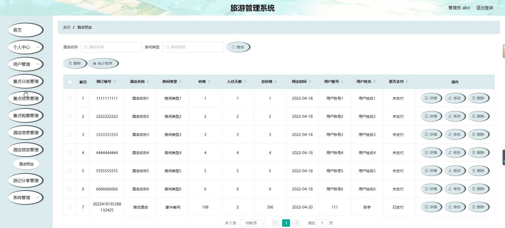

#### 总结

基于Spring Boot的旅游管理系统通过多功能模块的设计和实现，有效地提升了旅游业务的管理效率和服务水平，满足了现代旅游者对信息化、智能化服务的需求。然而，系统在信息更新的及时性和用户体验的优化方面仍有进一步提升的空间。未来，可以结合更多的前沿技术，如大数据分析和人工智能，进一步完善系统功能和性能，为旅游管理领域的发展提供更加全面和强大的支持。

#### 使用说明

创建数据库，执行数据库脚本 修改jdbc数据库连接参数 下载安装maven依赖jar 启动idea中的springboot项目

后台地址：http://localhost:8080/springboot99u10/admin/dist/index.html

管理员  abo 密码 abo

前台地址：http://localhost:8080/springboot99u10/front/index.html
